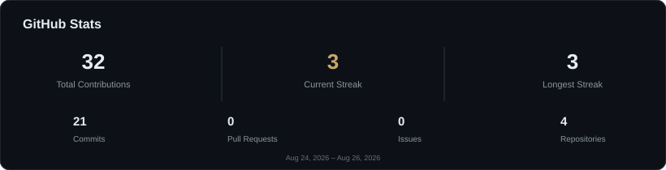
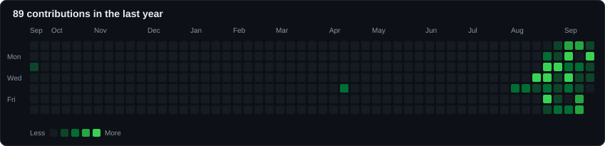

<div align="center">


<br/>


<br/><br/>

<a href="https://github.com/Viyan-Dabre">
  
</a>

<a href="https://www.linkedin.com/in/viyan-dabre-57293627a">
  
</a>

<a href="https://www.instagram.com/dabreviyan/">
  
</a>

<a href="mailto:viyandabre@gmail.com">
  
</a>

<!-- Portfolio badge: add once live
<a href="PORTFOLIO_URL">
  
</a>
-->

</div>

<br/>

## `who am I`

<br/>

Final-year IT undergrad (B.E., graduating 2027) who builds across the stack — Java, Python, JavaScript, React, Node — and leans toward projects where software has to make a judgment call: which route is safer, which signal to prioritize, which agent handles a task next. Most of that shows up in the projects below, from a route-risk classifier to a traffic-priority system for emergency vehicles.

<br/>

Right now the focus has shifted toward **agentic automation** — orchestrating task-specific AI agents, external APIs, and memory through n8n instead of writing one more monolithic script. Looking for a Software Engineering / Full-Stack internship to take that from personal projects into a production codebase.

<br/>

<table>
<tr>

<td width="55%" valign="top">

<br/>

**Primary** — Full-Stack Development  
`Java · Python · JS · React · Node`

<br/><br/>

**Secondary** — Applied Machine Learning  
`Cybersecurity fundamentals`

<br/><br/>

**Current focus** — AI agent automation  
`n8n · REST APIs · Workflow Automation`

<br/>

</td>

<td width="45%" valign="top">



</td>

</tr>
</table>

<br/>

## `./currently-building`

> **AI Agent Automation System** — *personal project, 2026–present*

An n8n-based system that coordinates task-specific AI agents, external APIs, and shared memory across workflows — not a finished product yet, actively in progress.

- Agent orchestration across multi-step workflows in **n8n**
- Job/internship application automation
- Portfolio assistant components
- **WhatsApp** notification pipeline via REST APIs

<br/>

## `./stack`

<table>
<tr>

<td valign="top" width="25%">

**Languages**

<br/>


</td>

<td valign="top" width="25%">

**Web**

<br/>


</td>

<td valign="top" width="25%">

**AI / Automation**

<br/>


</td>

<td valign="top" width="25%">

**Tools**

<br/>


</td>

</tr>
</table>

<br/>

## `./activity`

<div align="center">


<br/><br/>



<br/><br/>

<a href="https://github.com/Viyan-Dabre">

  

</a>

</div>

<br/>

## `./projects`

<table>

<tr>

<td width="50%" valign="top">

### SafeStreets

**Accident Prediction & Route Safety System**

`Jan 2026 – Apr 2026`

Machine learning model that classifies route accident risk (Low / Medium / High) from live weather and location data, then recommends safer or faster alternate routes.

- Feature set built from temperature, humidity, visibility, wind speed, precipitation
- Pulls live data via **Google Maps API** and **OpenWeather API**
- Route recommendation engine on top of the risk classifier

`Python` `Machine Learning` `Google Maps API` `OpenWeather API`

</td>

<td width="50%" valign="top">

### Signal Sathi

**Smart Traffic & Emergency Vehicle Priority System**

`Jan 2026 – Apr 2026`

Traffic management system that reads real-time vehicle density from sensor-based monitoring and adjusts signal timing to match live congestion.

- Dynamic signal-adjustment logic for traffic flow
- Automatic signal-path clearing for approaching emergency vehicles

`Sensor Monitoring` `Real-time Signal Control`

</td>

</tr>

<tr>

<td width="50%" valign="top">

### ResQNet

**Ambulance Emergency Service System**

`Jul 2025 – Nov 2025`

Web platform that centralizes emergency requests and coordinates in real time between users and ambulance service providers.

- Request registration and management workflow
- Real-time coordination between requesters and providers

`Full-Stack Web App`

</td>

<td width="50%" valign="top">

### Tender Vista

**Digital Tender Management System**

`Jan 2025 – May 2025`

Full-stack platform that digitizes a manual, paper-based tender process end-to-end.

- Automated tender allocation and status tracking
- Reduced manual dependency, improved process transparency

`Python` `MySQL` `HTML` `CSS`

</td>

</tr>

<tr>

<td width="50%" valign="top">

### Jet Set Go

**Java-Based Flight Booking System**

`Jul 2024 – Dec 2024`

Flight booking system with secure login authentication supporting booking, cancellation, and flight management, plus an admin dashboard.

- Secure authentication flow
- Admin dashboard for flight and passenger data

`Java` `OOP` `Authentication`

</td>

<td width="50%" valign="top">

### AI Agent Automation System

**Personal Project** · `2026 – Present`

See [`./currently-building`](#currently-building) above — this one's still in motion.

`n8n` `REST APIs` `Workflow Automation`

</td>

</tr>

</table>

<sub>
Repository links will be added here as they're published.
</sub>

<br/>

## `./education`

**Bachelor of Engineering — Information Technology** · 2023–2027

St. Francis Institute of Technology, Mumbai University, Borivali · CGPA 6.88/10

<br/>

## `./certifications`

- NPTEL Cybersecurity Certification — *Jul–Dec 2024*
- Deloitte Cybersecurity Job Simulation (Forage) — *May 2025*
- UI/UX Design Course — *Completed, 2026*
- 🏆 1st Prize, Colloquium 2026 — Intra-College Technical Competition
- 🥈 Consolation Prize, Colloquium 2025 — Intra-College Technical Event

<br/>

## `./connect`

<div align="center">

<a href="https://github.com/Viyan-Dabre">GitHub</a>
&nbsp;•&nbsp;
<a href="https://www.linkedin.com/in/viyan-dabre-57293627a">LinkedIn</a>
&nbsp;•&nbsp;
<a href="https://www.instagram.com/dabreviyan/">Instagram</a>
&nbsp;•&nbsp;
<a href="mailto:viyandabre@gmail.com">Email</a>
&nbsp;•&nbsp;
Portfolio <sub>(in progress)</sub>

</div>

<br/>

<details>

<summary><code>$ ./secret</code></summary>

<br/>

```text
$ ./secret

> initializing...

> loading traits.log

Builder of things that make a decision under pressure —

which route, which signal, which agent goes next.

Currently: teaching workflows to think for themselves.

Always: learning the next layer down.

$ _